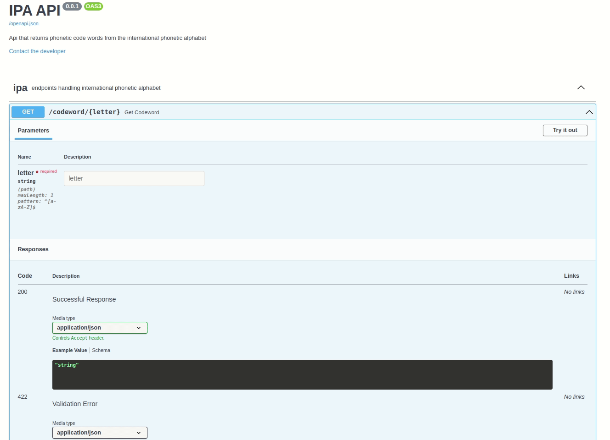

# [IPA API](https://devmegan.github.io/ipa-api/)

Api that returns phonetic code words from the international phonetic alphabet. Written with [FastAPI](https://fastapi.tiangolo.com/).

Built into docker image that lives on dockerhub here: [ipa-api image on dockerhub](https://hub.docker.com/repository/docker/devmegan/ipa-api)



## Run in docker

To use the image, run:

`$ docker container run -p 80:80 devmegan/ipa-api:latest`

To build and run from the [Dockerfile](Dockerfile):

```
$ docker image build -t ipa-api:latest .
$ docker container run -p 80:80 ipa-api:latest
```

## Run locally
Clone and use `uvicorn app:app --reload` to run live server.

## GET `/codeword/{letter}`

Takes a case-insensitive letter as a path parameter and returns a json response with the letter and corresponding phonetic code word.

eg: 

```
request: 

curl -X 'GET' \
  'http://127.0.0.1/codeword/A' \
  -H 'accept: application/json'

response:

{
    "letter":"A",
    "word":"Alfa"
}

```

### Validation

`/codeword/{letter}` endpoint has some validation:
- letter parameter must be an uppercase or lowercase character from the English alphabet (a-z, A-Z)
- letter parameter must have a maximum length of 1 character